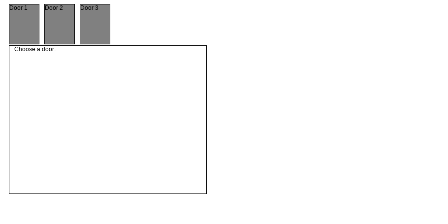

# Monty Hall Problem

Implementation of the famouse [Monty Hall problem](https://en.wikipedia.org/wiki/Monty_Hall_problem).

[LIVE VERSION HERE](https://victorqribeiro.github.io/montyhall/)

# About

I wrote this a long long time ago. I remeber the Monty Hall problem being the first time I got interested in coding a game experiment. I've update my original code just to translate things to english and to add support to mobile browsers, the rest is just like I first designed the game experiment.

Click on a door, if you want to stick with it, click on it again. If not, click another door to make the switch.

After you play you'll be show basic statistics so you can see for yourself what is the best way ti play the game: pick a port and stick to it, or to switch after a initial pick.
